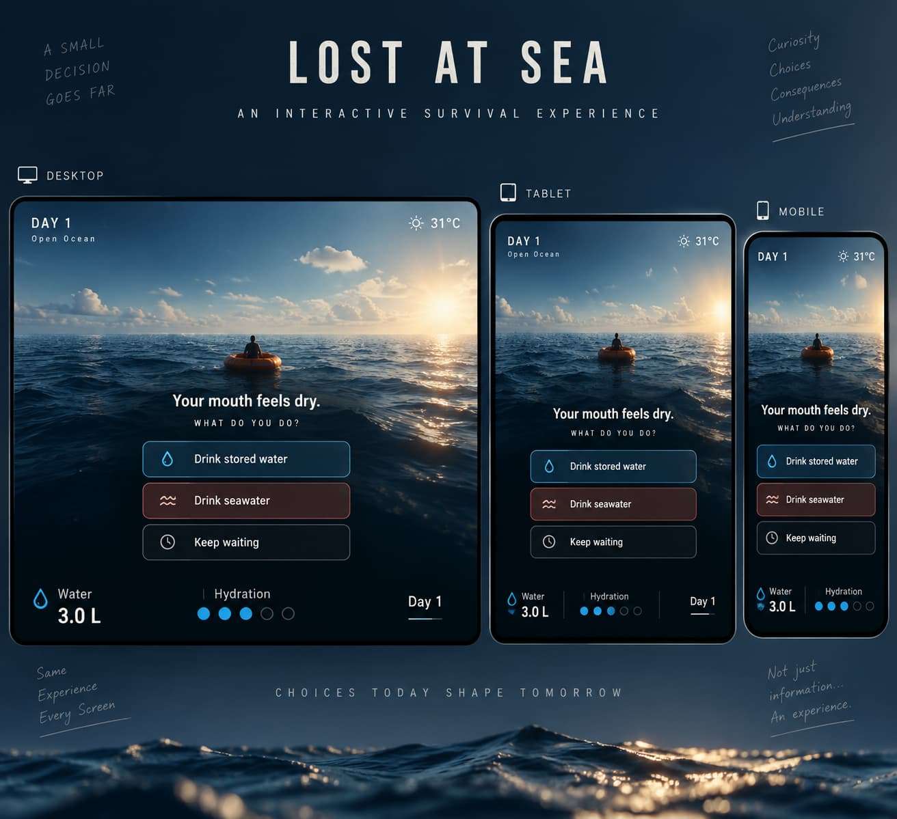
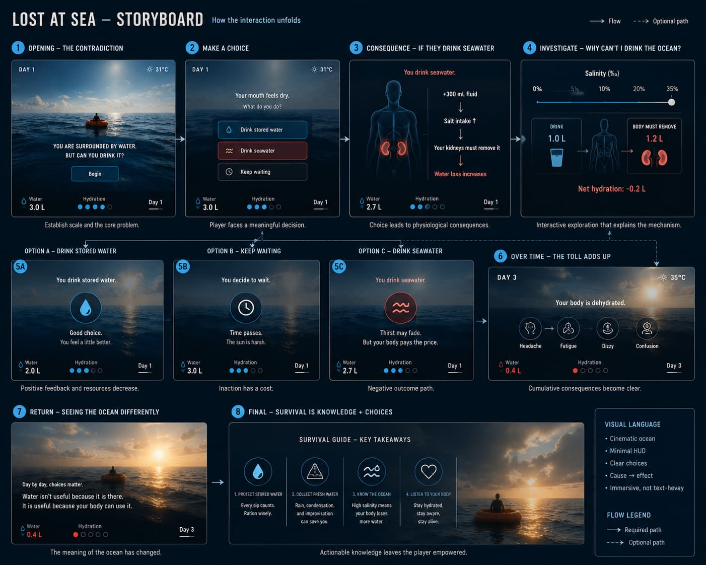
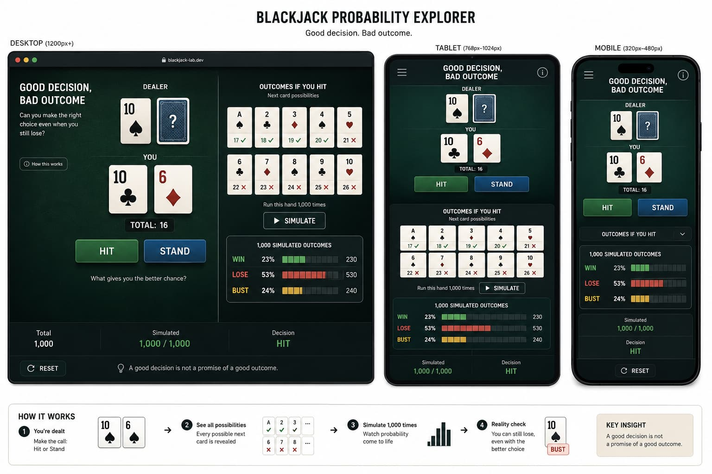
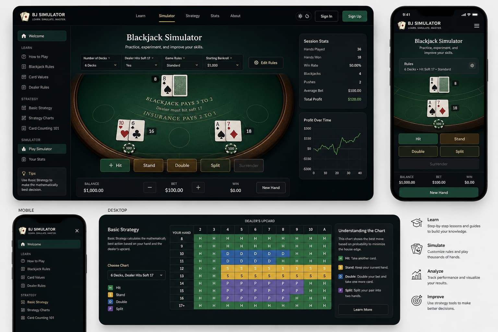
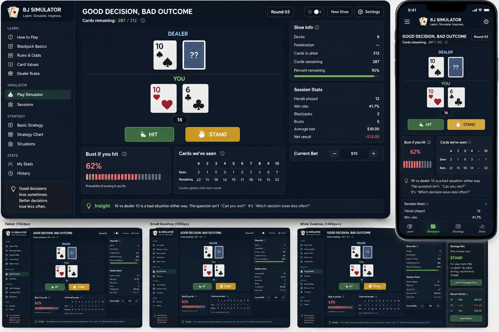

## Corroboration Evidence — Initial Ideation and Concept Development

This section documents the early ideation and concept-development process undertaken at the beginning of **COMP4020 Assignment 1**. ChatGPT was used as a collaborative tool to brainstorm possible directions, challenge initial assumptions, explore interaction models, and visualise potential interfaces before committing to a final concept.

### ChatGPT Project Workspace

The conversations and iterations were conducted within the following ChatGPT project:

* [COMP4020 Assignment 1 — Project Folder](https://chatgpt.com/g/g-p-6a80f3ed6dbc8191b4c917bca5536944-comp4020-ass-1/project)

### 1. Initial Ideation — Building the Concept from Scratch

The first conversation was used to explore possible directions for the assignment from an open starting point. Different interactive explainer concepts were brainstormed and compared, eventually narrowing the exploration toward two stronger directions: **survival at sea** and **blackjack probability**.

* [Initial brainstorming and concept exploration](https://chatgpt.com/g/g-p-6a80f3ed6dbc8191b4c917bca5536944-comp4020-ass-1/shared/c/6a80f6cf-2ecc-83ec-a222-41eeaa08d0e0?owner_user_id=user-waOgCFGvkPzUiemMby0X67mh)

### 2. Concept Exploration — Survival at Sea

The first shortlisted direction explored an interactive survival experience based on being stranded at sea. The concept was developed around presenting educational information through **user decisions and their consequences**, rather than through a conventional article or information-heavy interface.

The discussion was then translated into visual explorations to investigate the intended atmosphere, interface hierarchy, and possible interaction sequence.

* [Survival at Sea concept and visual exploration](https://chatgpt.com/g/g-p-6a80f3ed6dbc8191b4c917bca5536944-comp4020-ass-1/shared/c/6a80f934-eeec-83ec-bf8b-f840e51c3bfb?owner_user_id=user-waOgCFGvkPzUiemMby0X67mh)

**Visual concept — initial interface**

**Visual concept — interaction storyboard**

### 3. Concept Exploration — Blackjack Probability

The second shortlisted direction explored blackjack as an interactive way of explaining **probability, uncertainty, and decision-making**.

The initial concept focused on the idea of **“Good Decision, Bad Outcome”**: demonstrating that a statistically appropriate decision does not guarantee a successful individual outcome.

Further iterations explored how the experience could move beyond a single isolated blackjack hand toward a continuous simulation in which previously dealt cards affect the composition of the remaining deck. This helped shape the educational opportunity around the difference between **decision quality, random outcomes, and changing probabilities**.

* [Initial Blackjack Probability concept](https://chatgpt.com/g/g-p-6a80f3ed6dbc8191b4c917bca5536944-comp4020-ass-1/shared/c/6a80f992-3008-83ec-a4c8-4ea0085c7dd0?owner_user_id=user-waOgCFGvkPzUiemMby0X67mh)
* [Further Blackjack interface and interaction exploration](https://chatgpt.com/g/g-p-6a80f3ed6dbc8191b4c917bca5536944-comp4020-ass-1/shared/c/6a811e04-ca2c-83ec-b7c0-41ab49bae531?owner_user_id=user-waOgCFGvkPzUiemMby0X67mh)

**Visual explorations**

### 4. Informal Discussion and Refinement

A later conversation, conducted informally in Indonesian, was used to further challenge and refine the shortlisted ideas. In particular, the discussion considered the feasibility of implementing the concepts, what educational content would need to be communicated, how the interactions could work in practice, and which direction would be more suitable for development into an MVP.

This conversation represents a transition from **open-ended ideation toward implementation-oriented design thinking**.

* [Informal concept refinement discussion](https://chatgpt.com/g/g-p-6a80f3ed6dbc8191b4c917bca5536944-comp4020-ass-1/shared/c/6a811929-d208-83ec-bdb2-1143c2b354e7?owner_user_id=user-waOgCFGvkPzUiemMby0X67mh)

### Outcome of the Exploration

Together, these conversations provide evidence of an iterative design process rather than a single generated solution. The process progressed through:

**open-ended brainstorming → concept comparison → visual exploration → interaction exploration → feasibility discussion → concept refinement**

The resulting visual concepts and conversation history provide corroborating evidence of how the project direction developed before moving into MVP design and implementation.
